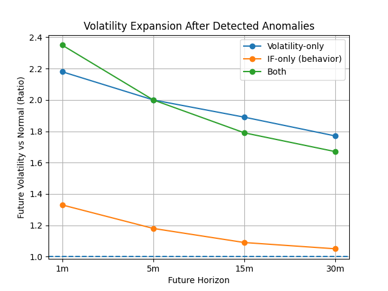

# Binance Realtime Anomaly Detection

A real-time anomaly detection pipeline that identifies abnormal trading activity in BTCUSDT and validates its relationship with future market volatility.

This project uses Binance WebSocket streaming, window-based feature engineering, and Isolation Forest to detect **market regime shifts in trading activity**.

---

# Overview

Live trade data is streamed from Binance and aggregated into fixed time windows.
For each window, market activity features are calculated and evaluated using an anomaly detection model.

The collector runs continuously on a **GCP Compute Engine VM**, allowing multi-day validation on live market data rather than static historical datasets.

Goal:

Detect **market regime shifts in trading activity** and evaluate whether these anomalies precede increased short-term price movement.

---

# System Architecture

```
Binance WebSocket (btcusdt@trade)
        ↓
Realtime trade stream
        ↓
20-second window aggregation
        ↓
Feature engineering
(trade count, volume, avg size, return, volatility)
        ↓
StandardScaler
        ↓
Isolation Forest anomaly detection
        ↓
Rolling retraining
        ↓
CSV persistence
        ↓
Analysis scripts
```

The collector processes trades in real time and runs continuously to support long-horizon signal validation.

---

# Motivation

This project was inspired by limitations observed in a previous real-time monitoring system built on Upbit trade streams.

The earlier system relied on SMA-based thresholds for anomaly detection. While effective for simple monitoring, it produced frequent false signals and struggled to detect regime changes driven by **trading activity rather than price level**.

That system was part of the following project:

Upbit Data Pipeline (team project)
[https://github.com/DE7-team6-final/upbit-data-pipeline](https://github.com/DE7-team6-final/upbit-data-pipeline)

Based on these observations, the current system focuses on **behavior-based anomaly detection**, using trade intensity, volume, and volatility features combined with an unsupervised anomaly detection model.

The objective is to detect **market activity regime shifts** and validate whether these events precede abnormal future price movement.

---

# Data Source

Binance WebSocket stream:

```
btcusdt@trade
```

The system uses the **exchange event timestamp** rather than local system time to ensure accurate temporal ordering.

---

# Window Features (20 seconds)

For each window the following features are calculated:

• Trade count
• Total traded volume
• Average trade size
• Price return
• Price volatility

Window size was selected after analyzing variability across candidate intervals using the **coefficient of variation**.

---

# Model

Isolation Forest with feature standardization.

Pipeline:

• Window features standardized using **StandardScaler**
• Initial training buffer: **500 windows (~2.8 hours)**
• **Rolling retrain every 100 windows (~33 minutes)** to prevent concept drift
• Real-time anomaly scoring for each window
• Outputs anomaly prediction (`-1` / `1`) and anomaly score

Rolling retraining keeps the model aligned with current market conditions and maintains a **stable anomaly rate (~2–9% across most hours)** during long-running collection.

Results are saved daily:

```
data/window_results_YYYY-MM-DD.csv
```

Daily rotation prevents unbounded file growth and supports continuous collection.

---

# Key Findings (Signal Validation)

The system was validated on **~15,689 scored windows across 3+ days** of continuous data collection on GCP.

Future movement is measured as the **sum of absolute returns over the next 5 minutes (15 windows)**.

---

## 1. Isolation Forest detects behavioral anomalies beyond volatility

A baseline comparison against a simple volatility threshold
(**window volatility mean + 2×std**) shows:

• 55 windows flagged by both methods
• 27 windows flagged by IF only (normal volatility but unusual trading behavior)

Jaccard similarity:

```
0.567
```

Approximately **33% of IF anomalies occur during normal-volatility conditions**, indicating the model captures **order-flow microstructure signals** invisible to threshold-based methods.

---

## 2. All anomaly types precede larger future price moves

| Group    | Mean abs move | vs Normal |
| -------- | ------------- | --------- |
| Normal   | 0.003615      | 1.00x     |
| VOL-only | 0.007259      | **2.01x** |
| IF-only  | 0.004255      | **1.18x** |
| Both     | 0.007236      | **2.00x** |

Statistical test:

```
Mann-Whitney U test
p < 0.001 for IF-only and Both vs Normal
```

---

## 3. Signal stability across dataset sizes

| Dataset          | Windows | VOL-only | IF-only | Both  |
| ---------------- | ------- | -------- | ------- | ----- |
| Initial session  | ~4,700  | 2.39x    | 1.15x   | 2.37x |
| 3-day validation | ~15,689 | 2.01x    | 1.18x   | 2.00x |

Signal ratios converged across datasets, confirming the finding is **not an artifact of small sample size**.

## 4. Signal decay across time horizons

To understand how long the anomaly signal persists, future volatility was evaluated across multiple horizons.

Future movement is measured as the **sum of absolute returns over the following windows**.

| Horizon    | VOL-only | IF-only | Both  |
| ---------- | -------- | ------- | ----- |
| 1 minute   | 2.18×    | 1.33×   | 2.35× |
| 5 minutes  | 2.00×    | 1.18×   | 2.00× |
| 15 minutes | 1.89×    | 1.09×   | 1.79× |
| 30 minutes | 1.77×    | 1.05×   | 1.67× |

Statistical tests (Mann–Whitney U):

• **VOL-only anomalies remain highly significant across all horizons**

• **IF-only anomalies remain significant up to ~15 minutes**

• **Behavior-only signal disappears by 30 minutes**

### Signal decay visualization



### Interpretation

The anomaly signal is **strongest immediately after detection and gradually decays over time**.

Key observations:

• **Volatility anomalies** correspond to sustained high-activity market regimes.

• **Behavior-only anomalies** represent subtle microstructure shifts that tend to resolve quickly.

• **Combined anomalies** indicate strong market regime transitions and produce the largest volatility expansion.

These results suggest the anomaly detector acts primarily as a **short-term market activity signal**, rather than a long-horizon regime predictor.


---

# Overall Interpretation

• **Volatility anomalies** correspond to high-activity market regimes and precede roughly **2× larger price movement**.

• **Behavior-only anomalies** (Isolation Forest without volatility spike) precede **~18% larger movement**, suggesting subtle order-flow changes before volatility expansion.

• **Combined signals** indicate the market is likely entering a **high-volatility regime**.

The model therefore detects **market activity regime transitions**, not just price spikes.

This acts as a **market risk / activity signal**, not a directional trading signal.

---

# Setup

```
python -m venv .venv
source .venv/bin/activate
pip install -r requirements.txt
```

---

# Run with Docker (Recommended)

Build image:

```
docker build -t binance-realtime-anomaly .
```

Run collector:

```
docker run -d \
  --name anomaly \
  -v $(pwd)/data:/app/data \
  -v $(pwd)/reports:/app/reports \
  binance-realtime-anomaly
```

View logs:

```
docker logs -f anomaly
```

Stop:

```
docker stop anomaly
docker rm anomaly
```

---

# Run Locally (Development)

```
nohup python -u src/collector.py > collector.log 2>&1 &
```

---

# Analysis Scripts

Score distribution

```
python scripts/analysis/check_scores.py
```

Pre-move lead-lag validation

```
python scripts/analysis/check_pre_move.py
```

Pre-move by anomaly type

```
python scripts/analysis/check_pre_move_by_type.py
```

Baseline comparison (IF vs volatility threshold)

```
python scripts/analysis/compare_baseline.py
```

Anomaly rate by hour

```
python scripts/diagnostics/check_anomaly_by_hour.py
```

Results are appended to:

```
reports/
```

---

# Project Structure

```
src/
    collector.py

scripts/
    analysis/
        analyze_results.py
        check_pre_move.py
        check_pre_move_by_type.py
        check_scores.py
        compare_baseline.py
    diagnostics/
        check_anomaly_by_hour.py
        measure_rate.py
    experiments/
        analyze_event_specific_time.py
        analyze_events.py
        analyze_window.py
        save_score_summary.py

data/
    raw/
    samples/

reports/
logs/
docs/
```

---

# Notes

• Designed for **long-running real-time data collection**

• Deployed on **GCP Compute Engine for continuous 24/7 operation**

• Raw datasets and logs are excluded from version control

• Focuses on **behavior-based anomaly detection in market microstructure**

---

# Future Work

Possible extensions:

• Hour-of-day normalization
• Order book depth features
• Multi-asset anomaly detection
• Anomaly clustering and regime classification
